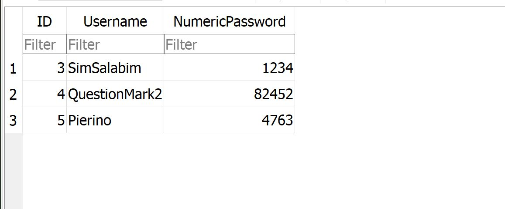

# Database connection with Sqlite3 

## Introduction
An application where the admin manages the account on db.
He could:
1) Add a new account
2) Delete an account
3) List all the accounts
4) Update the password of account
5) Exit from the system

     

## Use the database
Copy the class_DBConnect.py to have your Database and import it in your file as in my example main. 

## Visualize the database
To visualize the database I suggest Database Browser for sqlite

     
